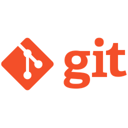

### Hi there, I'm Chris!
## I am a Full-stack Web Developer
- Currently looking for full-time work opportunities in the field
- Fan of all things JavaScript
- On a life-long journey of trying to learn everything
- Check out below for more details!

### My Toolkit  

      
      
      
      
      
      
      
      
      
    
    
    
    
    
    

### Connect With Me  

    
    
    

